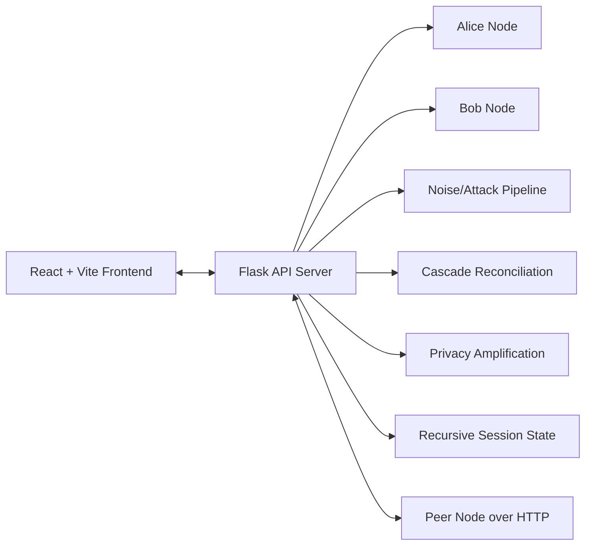
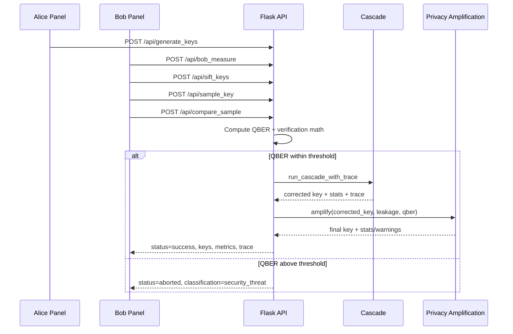
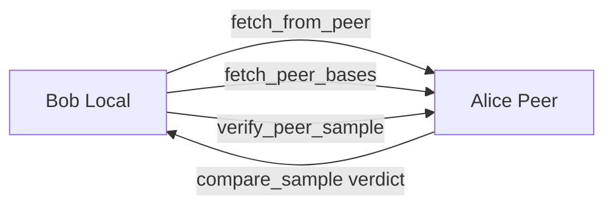

# QSafe BB84 - Deep Forensic Project Analysis

## Multi-Perspective Lens

This report analyzes the repository from three concurrent viewpoints:

- Software Architect: system boundaries, protocol pipeline, reliability model, and trust assumptions.
- Lead Developer: implementation details, data flow, module responsibilities, and failure handling.
- Technical Product Manager: user workflows, differentiators, operational usability, and delivery readiness.

---

## 1) High-Level Overview

### Core Purpose

QSafe is an end-to-end BB84 Quantum Key Distribution simulator that demonstrates how two parties establish a shared secret key over an untrusted channel while detecting eavesdropping/noise via QBER and protocol verification.

### Problem It Solves

Conventional key exchange relies on computational hardness assumptions. BB84 offers a physics-based security model where measurement disturbance exposes interception attempts. QSafe converts this into a practical educational and engineering platform with:

- quantum-state generation and measurement,
- realistic noise/attack simulation,
- post-processing with Cascade reconciliation and Privacy Amplification,
- networking and secure messaging workflows,
- recursive keying experiments for throughput improvements.

### Architecture (High-Level)



### Runtime Pattern

- Single Flask process maintains in-memory protocol state (`alice`, `bob`, noise config, message buffers, recursive session).
- Frontend orchestrates protocol actions through explicit role-based steps.
- Network mode uses HTTP peer callbacks to simulate distributed Alice/Bob nodes.

---

## 2) Granular Feature Matrix

| Feature | Surface | Logic Flow | Key Files |
|---|---|---|---|
| Quantum key generation | Alice UI + API | Alice creates random bits/bases, encodes qubit symbols, clears previous key state before new round | app.py, alice.py, randomkey.py, AlicePanel.tsx |
| Quantum channel simulation | API | Serialize qubit metadata, apply Eve intercept, packet loss, network bit flips | app.py |
| Bob measurement | Bob UI + API | Rebuild circuits, choose random bases, optionally apply hardware/custom noise simulator, measure each qubit | bob.py, noise_simulator.py, app.py |
| Sifting | Bob UI + API | Compare Alice/Bob bases, trim to min length under packet loss, keep matched positions, compute sync metrics | app.py, bob.py, BobPanel.tsx |
| Sample verification | Bob UI + API | Bob samples sifted key, Alice compares sample bits, derives QBER and math payload | app.py, BobPanel.tsx |
| Verification gate | API | QBER threshold admission to post-processing; p-hat retained as advisory telemetry | app.py |
| Abort classification | API + UI | Classify failures as `security_threat`, `software_error`, or `environmental_noise`; UI changes response semantics | app.py, BobPanel.tsx |
| Cascade reconciliation | API + UI | Block parity rounds, binary search localization, ripple rechecks, residual error assessment, trace export | cascade.py, app.py, CascadeVisualizer.tsx |
| Privacy amplification | API | Toeplitz-matrix compression with leakage model; short-key safeguards return warnings instead of hard crash | privacy.py, app.py |
| Fast-success path | API + UI | If QBER is zero and residual errors are zero, mark fast-success and improve UX messaging | app.py, BobPanel.tsx |
| Environmental-noise UX routing | Bob UI | Do not render hard security abort; keep user in correction loop and auto-focus cascade section | BobPanel.tsx |
| Security metrics dashboard | Bob UI | Display QBER, p-hat, entropy, correlation, efficiency status badges | SecurityMetrics.tsx |
| Role-based lab workflow | Frontend | Alice and Bob role toggle with step progression and reset semantics | App.tsx, ProjectContext.tsx, AlicePanel.tsx, BobPanel.tsx |
| Network connect/disconnect | Dashboard UI + API | Discover peer by IP, connect handshake, status polling, disconnect propagation | app.py, ConnectionPanel.tsx, ProjectContext.tsx |
| P2P basis and sample exchange | API | Fetch public bases, verify sample against remote Alice endpoint, relay classification/context | app.py |
| Secure messaging | API + UI | Encrypt/decrypt message payloads using shared key, fetch from peer or local queue | app.py, Messaging.tsx, ChatInterface.tsx |
| Chat management | API + UI | Send/receive chat messages, clear buffers, optional Eve interception endpoint | app.py, ChatInterface.tsx |
| Quick QKD endpoint | API | One-shot demo generation/measurement/sift/sample/final key response | app.py |
| Recursive BB84 mode | API + UI | Plant seed from prior key, derive rolling basis bias, purge old seed, send encrypted rounds with metrics | recursive_session.py, app.py, RecursiveBB84.tsx |
| Noise control panel | Dashboard UI | Attack presets plus manual post-sift noise injector and tolerance controls | ConnectionPanel.tsx, BobPanel.tsx, ProjectContext.tsx |
| Manual noise injection | Bob UI | Inject flips after sifting to stress reconciliation/visualization | BobPanel.tsx |
| Key lifecycle visualization | Alice UI | Show raw -> sifted -> corrected -> final secret funnel metrics | KeyLifecycleFunnel.tsx, AlicePanel.tsx |
| Protocol comparison/overview | Frontend | Explain BB84 stages and project differentiators | ProjectOverview.tsx, ProtocolComparison.tsx |

---

## 3) Component Breakdown (Module Responsibilities)

### Backend Core

- app.py: central orchestrator for routes, protocol state, noise config, network mode, chat, recursive mode.
- alice.py: Alice node abstraction, raw bit/base preparation and encoded qubit creation.
- bob.py: Bob measurement logic with ideal/noisy simulator modes and sifting/sampling helpers.
- node.py: shared lightweight logger base class.

### Protocol Processing

- cascade.py: adaptive Cascade engine with queue-based ripple rechecks, parity accounting, convergence stats, and trace.
- privacy.py: binary entropy and Toeplitz-based privacy amplification, including short-key soft guards.
- noise_simulator.py: custom and hardware-like noise model construction for Qiskit backend execution.
- randomkey.py: random bit/base generation and state encoding helper.

### Recursive Session

- recursive_session.py: manages rolling seed key, bias derivation, deterministic in-memory purge of old seed.

### Frontend Shell + State

- client/src/App.tsx: tab navigation and role-conditioned lab routing.
- client/src/context/ProjectContext.tsx: shared global state for roles, connection, key pipeline, noise settings, cascade/PA outputs.

### Frontend Protocol UI

- AlicePanel.tsx: Alice generation controls and key lifecycle funnel.
- BobPanel.tsx: Bob step engine (receive/sift/verify), abort classification UX, fast-success, environmental routing.
- CascadeVisualizer.tsx: block mismatch display, binary-search correction animation, final trace stage.
- SecurityMetrics.tsx: QBER/entropy/correlation/efficiency cards with threshold semantics.

### Frontend Network/Comms

- ConnectionPanel.tsx: peer connect + attack/noise profile controls.
- ChatInterface.tsx and Messaging.tsx: encrypted messaging workflows.
- LogTerminal.tsx: operational event log stream.

### Frontend Product Story

- ProjectOverview.tsx: protocol narrative with cascade/privacy mention and logic flow visuals.
- ProtocolComparison.tsx: comparative explanatory screen.
- RecursiveBB84.tsx: recursive round dashboard, bias gauge, round telemetry.

### Validation Scripts

- test_flow.py, test_advanced_noise.py, test_chat.py, test_chat_stateless.py, test_p2p_sync.py.
- verify_full_flow.py, verify_network_error.py, verify_network_sifting.py, verify_quantum_channel.py, verify_sifting.py, verify_dbs_sync.py.

---

## 4) Implementation Details (Minute-Level)

### Protocol and Security Logic

- QBER is computed from sampled sifted bits.
- Verification uses QBER-threshold admission; p-hat and secret-rate math are exposed for observability.
- Abort semantics are typed (`security_threat`, `software_error`, `environmental_noise`) rather than one generic failure.
- Structured abort context includes threshold deltas and residual diagnostics.

### Error Handling and Edge Cases

- Sample index guards: uniqueness, integer type, in-range validation.
- Sample length mismatch between Alice/Bob is detected early.
- Sifting trims basis arrays by min length under packet loss to avoid index errors.
- Residual mismatch after reconciliation is surfaced as software integrity issue.
- Privacy amplification short-key outcomes return warnings and safe fallbacks instead of uncontrolled crash loops.
- Fast-success path improves UX for perfect channel runs.

### Data Structures and Patterns

- Protocol bits are represented as integer arrays across backend/frontend.
- Trace structures (cascade rounds/corrections) are JSON-serializable and visualized directly.
- Noise configuration and attack mode are centralized mutable state in backend.
- Frontend maintains cross-step state machine in context + per-panel local states.

### Crypto/Processing Choices

- Cascade: adaptive initial block size from observed QBER, parity exchanges counted as leakage.
- Privacy amplification: Toeplitz matrix compression seeded deterministically from QBER.
- Encryption endpoints use shared key bitstring pipeline integrated with chat/messaging flows.

---

## 5) Sequence of Operation (Main Flow)

### BB84 Standard Flow



### Network Mode Variant



### Recursive BB84 Flow

1. Seed key is planted from prior successful BB84 output.
2. Bias is derived from seed ratio and constrained to a safe range.
3. New round uses biased basis distribution.
4. Message is encrypted with newly generated round key.
5. Old seed is purged from memory; new key becomes next seed.

---

## 6) Full Tech Stack and Tooling

### Languages

- Python (backend/protocol scripts)
- TypeScript + TSX (frontend)
- JavaScript/JSON/CSS/HTML

### Backend Frameworks and Libraries

- Flask, Flask-CORS
- NumPy, SciPy
- Qiskit, Qiskit Aer
- Requests

### Frontend Frameworks and Libraries

- React
- Vite
- Framer Motion
- Axios
- Lucide React
- React Router DOM (dependency)

### Build and Quality Tooling

- TypeScript compiler (`tsc`)
- ESLint
- npm scripts for dev/build/preview/lint

### Test/Verification Tooling

- Python script-based integration checks against local API server

---

## 7) Product and Delivery Readout

### Strengths

- Rich protocol fidelity for an educational project (noise, attacks, reconciliation, PA).
- Distinctive engineering features: recursive BB84, abort classification semantics, cascade visual diagnostics.
- Strong UX instrumentation (logs, metrics, warning/success states).
- Good API breadth for both local and peer-distributed simulations.

### Risks / Technical Debt

- Stateful singleton backend objects limit horizontal scalability.
- Some frontend files run with type checking disabled (`@ts-nocheck`).
- Legacy endpoints coexist with newer ones; API surface is broad and may need consolidation.
- No formal test framework harness (script-based verification only).

### Recommended Next Improvements

1. Add OpenAPI/Swagger contract for all active endpoints.
2. Introduce pytest-based automated suites with fixtures and CI.
3. Split app.py into blueprints/services for maintainability.
4. Add persistent state option (Redis/DB) for multi-process deployment realism.
5. Remove `@ts-nocheck` progressively and enforce typed contracts.

---

## 8) Directory Tree (Current Repo Snapshot)

```text
bb84/
  app.py
  alice.py
  bob.py
  node.py
  cascade.py
  privacy.py
  noise_simulator.py
  randomkey.py
  recursive_session.py
  requirements.txt
  test_flow.py
  test_advanced_noise.py
  test_chat.py
  test_chat_stateless.py
  test_p2p_sync.py
  verify_full_flow.py
  verify_network_error.py
  verify_network_sifting.py
  verify_quantum_channel.py
  verify_sifting.py
  verify_dbs_sync.py
  client/
    package.json
    src/
      App.tsx
      components/
        AlicePanel.tsx
        BobPanel.tsx
        CascadeVisualizer.tsx
        ChatInterface.tsx
        ConnectionPanel.tsx
        KeyLifecycleFunnel.tsx
        LogTerminal.tsx
        Messaging.tsx
        ProjectOverview.tsx
        ProtocolComparison.tsx
        RecursiveBB84.tsx
        SecurityMetrics.tsx
      context/
        ProjectContext.tsx
```

---

## 9) Executive Summary

QSafe is a mature educational/prototyping platform for BB84 that goes beyond baseline simulation. Its strongest differentiators are end-to-end protocol traceability, practical failure classification, and interactive correction UX. The current implementation is feature-rich and demonstrably evolving toward production-grade reliability semantics, while still retaining classroom-friendly transparency.
