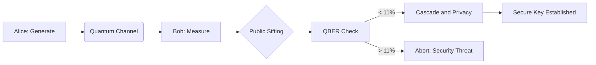

# QSafe BB84 - Quantum Key Distribution Simulation


QSafe is an end-to-end BB84 protocol simulator with a Flask backend and React frontend. It demonstrates secure key generation over a noisy/insecure quantum channel, including:

- Quantum state preparation and measurement
- Sifting and QBER-based verification
- Cascade error detection/correction with trace visualization
- Privacy amplification with short-key safeguards
- P2P key sync and encrypted messaging
- Recursive BB84 mode (rolling bias from previous key)


## Table of Contents

- [Why This Project Exists](#why-this-project-exists)
- [Core Features](#core-features)
- [Visual Logic Flow](#visual-logic-flow)
- [Tech Stack](#tech-stack)
- [Project Structure](#project-structure)
- [Prerequisites](#prerequisites)
- [Getting Started](#getting-started)
- [Usage Guide](#usage-guide)
- [API Endpoints](#api-endpoints)
- [Testing and Verification Scripts](#testing-and-verification-scripts)
- [Operational Notes and Edge Cases](#operational-notes-and-edge-cases)
- [Contributing](#contributing)
- [License](#license)

## Why This Project Exists

Classical key exchange assumptions are threatened by quantum computing advances. BB84 provides an information-theoretic approach where eavesdropping disturbs quantum states and becomes detectable.

This project is built for education, experimentation, and protocol engineering:

- Understand BB84 mechanics beyond textbook diagrams
- Observe realistic noise and attack effects on QBER
- Study reconciliation (Cascade) and key hardening (Privacy Amplification)
- Experiment with recursive session ideas to improve effective throughput

## Core Features

### 1) BB84 End-to-End Pipeline

- Alice generates random raw bits and random bases
- Qubits are encoded and sent through simulated quantum channel
- Bob measures with random bases
- Public-channel sifting removes mismatched-basis positions
- Sampling estimates QBER and verification status

### 2) Advanced Noise and Attack Modeling

- Interception density (`p`) for partial/full eavesdropping
- Packet loss simulation
- Network bit-flip noise simulation
- Channel depolarizing/thermal noise
- GenericBackendV2 hardware-like noise support
- Attack presets: `none`, `eavesdrop`, `mitm`, `dos`

### 3) Cascade Reconciliation

- Adaptive block sizing by estimated error rate
- Multi-round parity checks and binary search localization
- Ripple-style rechecks via queueing
- Trace output for round-by-round diagnostics
- Interactive frontend visualizer for mismatch blocks and correction flow

### 4) Privacy Amplification

- Toeplitz-matrix-based compression
- Leakage-aware target sizing from QBER + parity leakage
- Safety margin parameters (`sigma`, `alpha`)
- Graceful fallback for short keys (no hard crash on tiny output)

### 5) Verification and Classification Semantics

- QBER-threshold driven verification gate
- Distinct abort classifications:
  - `security_threat`
  - `software_error`
  - `environmental_noise`
- Structured `abort_context` payload to aid debugging/UI interpretation
- Fast-success path for perfect (`QBER = 0`) runs

### 6) P2P Networking and Secure Chat

- Peer discovery/initiation by IP
- Key generation and synchronization across peers
- Message encryption/decryption endpoints
- Chat message exchange with clear/intercept utilities

### 7) Recursive BB84 Session

- **Special Sauce #1 - Recursive BB84 Mode:** seeded rolling bias based on prior key distribution to improve future-round efficiency
- Per-round key lifecycle with deterministic purge semantics
- Message activity timeline with metrics and round metadata

### 8) Smart Abort Classification

- **Special Sauce #2 - Abort Classification:** verification distinguishes `security_threat`, `software_error`, and `environmental_noise`
- This separates true eavesdropping risk from hardware/channel conditions and software-state faults
- Improves operator decisions and makes failure handling production-like

## Visual Logic Flow



## Tech Stack

### Backend

- Python
- Flask + Flask-CORS
- NumPy, SciPy
- Qiskit, Qiskit Aer
- Requests

### Frontend

- React + TypeScript
- Vite
- Framer Motion
- Axios
- Lucide React

## Project Structure

```text
bb84/
  app.py
  alice.py
  bob.py
  node.py
  cascade.py
  privacy.py
  noise_simulator.py
  randomkey.py
  recursive_session.py
  requirements.txt
  test_flow.py
  test_advanced_noise.py
  test_chat.py
  test_chat_stateless.py
  test_p2p_sync.py
  verify_full_flow.py
  verify_network_error.py
  verify_network_sifting.py
  verify_quantum_channel.py
  verify_sifting.py
  verify_dbs_sync.py
  client/
    package.json
    src/
      App.tsx
      components/
        ProjectOverview.tsx
        ConnectionPanel.tsx
        AlicePanel.tsx
        BobPanel.tsx
        CascadeVisualizer.tsx
        SecurityMetrics.tsx
        RecursiveBB84.tsx
        ChatInterface.tsx
      context/
        ProjectContext.tsx
```

## Prerequisites

- Python 3.10+
- Node.js 18+
- npm 9+
- (Optional) virtual environment tooling

## Getting Started

### 1) Clone

```bash
git clone https://github.com/Neha-george/_bb84_.git
cd _bb84_/bb84
```

### 2) Backend setup

```bash
python -m venv .venv
# Windows PowerShell
.venv\Scripts\Activate.ps1

# Linux/macOS
source .venv/bin/activate

pip install -r requirements.txt
python app.py
```

Backend runs on `http://127.0.0.1:5000` by default.

### 3) Frontend setup

Open a second terminal:

```bash
cd client
npm install
npm run dev
```

Frontend runs on Vite local URL (typically `http://127.0.0.1:5173`).

### 4) Production frontend build

```bash
cd client
npm run build
npm run preview
```

## Usage Guide

1. Open `Overview` to understand protocol stages.
2. In `Dashboard`, connect to a peer or operate local mode.
3. Switch role:
   - Alice: generate qubits
   - Bob: receive -> sift -> verify/finalize
4. Tune channel/attack/noise controls in Network panel.
5. Observe:
   - QBER and p-hat telemetry
   - Cascade visual reconciliation
   - Privacy amplification outcomes and warnings
6. Use `Secure Chat` after successful key establishment.

## API Endpoints

### Configuration and Metrics

- `GET /api/config`
- `POST /api/set_noise_config`
- `GET /api/get_noise_config`
- `POST /api/set_attack_mode`
- `GET /api/key_metrics`

### BB84 Core Flow

- `POST /api/generate_keys`
- `GET /api/get_quantum_data`
- `POST /api/bob_measure`
- `POST /api/sift_keys`
- `POST /api/verify_key`
- `POST /api/sample_key`
- `POST /api/compare_sample`
- `GET /api/alice/key_status`
- `POST /api/finalize_key`

### Networking and Peer Sync

- `POST /api/network/initiate`
- `POST /api/network/connect`
- `GET /api/network/status`
- `POST /api/network/disconnect`
- `POST /api/fetch_from_peer`
- `GET /api/public/bases`
- `POST /api/fetch_peer_bases`
- `POST /api/verify_peer_sample`

### Quick QKD and Messaging

- `POST /api/qkd/quick_generate`
- `POST /api/qkd/p2p_generate`
- `POST /api/qkd/sync_key`
- `POST /api/encrypt_message`
- `POST /api/decrypt_message`
- `GET /api/get_message`
- `POST /api/fetch_message_from_peer`

### Chat and Eve Utilities

- `POST /api/chat/send`
- `POST /api/chat/messages`
- `POST /api/chat/receive`
- `POST /api/chat/clear`
- `GET /api/eve/intercept`

### Recursive BB84

- `GET /api/recursive/status`
- `POST /api/recursive/plant_seed`
- `POST /api/recursive/send_message`

## Testing and Verification Scripts

This repository includes executable verification scripts (HTTP-flow tests) such as:

- `test_flow.py`
- `test_advanced_noise.py`
- `test_chat.py`
- `test_chat_stateless.py`
- `test_p2p_sync.py`
- `verify_full_flow.py`
- `verify_network_error.py`
- `verify_network_sifting.py`
- `verify_quantum_channel.py`
- `verify_sifting.py`
- `verify_dbs_sync.py`

Run a script with backend active:

```bash
python test_flow.py
```

## Operational Notes and Edge Cases

- Mismatched basis lengths due to packet loss are trimmed to min length before sifting.
- Verification distinguishes security failures from software/environmental classes.
- Environmental-noise flows can route users back to Cascade correction UX.
- Privacy amplification uses safe fallback behavior for tiny keys to avoid hard-fail loops.
- Fast-success path improves UX on perfect (`QBER=0`) rounds.
- Verification path is hardened against state inconsistency (sample-index and residual-alignment guards prevent off-by-one mismatch loops).

## Contributing

1. Fork the repository.
2. Create a feature branch.
3. Make focused changes with clear commit messages.
4. Run backend and frontend validation locally.
5. Open a pull request with:
   - What changed
   - Why it changed
   - Screenshots or logs (if UI/protocol behavior changed)

## License

No license file is currently present in the repository.

If you plan to open-source broadly, add a `LICENSE` file (MIT/Apache-2.0 are common choices).
